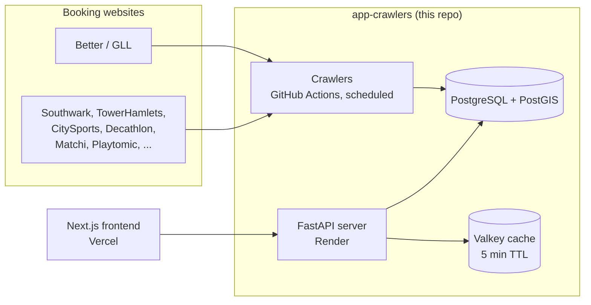

# Architecture

## System overview

Two independent processes share one database: a scheduled crawler pipeline that
writes availability, and a FastAPI server that reads it and serves the frontend.
Neither depends on the other being up.

## Components

- **Crawlers** (`sportscanner/crawlers/`). One Docker image, run on a schedule via
  GitHub Actions, one job per sport. Fetches availability from each provider's
  booking API, normalizes it into a shared schema, and upserts it into Postgres.
  See [`docs/crawlers.md`](docs/crawlers.md).
- **Database** (`sportscanner/storage/postgres/`). PostgreSQL with PostGIS, one
  table per sport plus a venue table. See [`docs/database.md`](docs/database.md).
- **API** (`sportscanner/api/`). FastAPI, serves search, venue lookup, health, and
  user endpoints to the frontend. See [`docs/api.md`](docs/api.md).
- **Cache**. Valkey, used by the API for near-static lookups (postcode geocoding,
  venues within a radius). Optional: the API works without it, just slower.

## Deployment

- Crawlers: Docker image built and pushed to GHCR on merge to `main`; run via
  GitHub Actions `workflow_dispatch`, one job per sport, triggered on a schedule by
  an external caller.
- API: same image, different entrypoint, deployed to Render via a webhook on image
  push.
- Frontend: separate repository, deployed to Vercel.

## Further reading

- [`docs/database.md`](docs/database.md): schema, indexing, idempotency, why
  Postgres and not a queue.
- [`docs/crawlers.md`](docs/crawlers.md): strategy pattern, concurrency capping,
  retries, circuit breaker.
- [`docs/api.md`](docs/api.md): search flow, caching, the SQL injection fixes.
