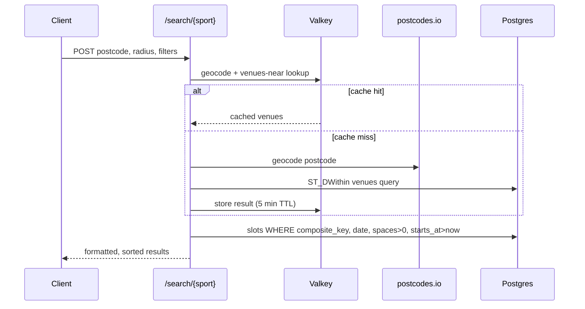

# API

FastAPI, deployed on Render. No `/api/v1/` prefix; routes are flat
(`/search/{sport}`, `/venues/near`, `/health/scrapers`).

## Search flow

`/search/{sport}` used to call its own `/venues/near` endpoint over HTTP to resolve
a postcode to nearby venues, an extra network hop to itself on every search request,
for data that barely changes minute to minute. It now calls the same underlying
function directly (`get_venues_near_postcode`), which `/venues/near` also calls; the
route and the internal call share one implementation.

## Caching: Valkey

Postcode to lat/lng (via postcodes.io) and venues within a radius (a PostGIS query)
are both near-static: the same postcode and radius combination returns the same
answer for long stretches of time, but was being recomputed and re-queried on every
single search. Both are now cached in Valkey (Redis-protocol-compatible) with a
5-minute TTL.

Caching is best-effort by design: if `VALKEY_URL` is not configured, or the cache is
unreachable, every cache function degrades silently to a cache miss and the request
falls through to postcodes.io and Postgres as before. A cache outage never turns
into an API error.

## Security: parameterized queries

Two endpoints previously built SQL by interpolating request parameters directly
into the query string:

- `/health/scrapers?sports=` used the `sports` query parameter as a table name and
  as an array literal, both unescaped.
- `/venues/near` built a parameterized, correctly-escaped query, then discarded it
  and ran a second, unparameterized version instead.

Both are fixed. `sports` is validated against an allow-list of the four real table
names before it can reach the query string (a table name can never be a bound SQL
parameter, so an allow-list is the only option there); the `/venues/near` query now
uses the parameterized version, with a fixed column name matching the actual schema.
