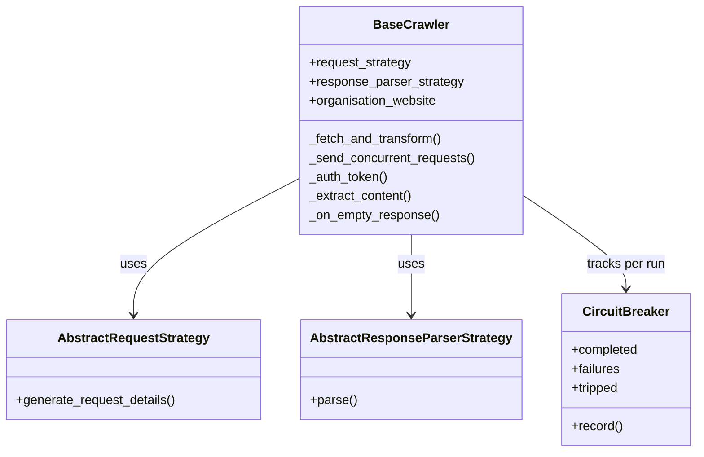

# Crawlers

## Architecture

A provider (Better, Southwark, TowerHamlets, and so on) supplies a request strategy
(how to build the HTTP request for a venue and date) and a response parser (how to
map the raw response into the unified slot schema). `BaseCrawler` owns everything
else: the fetch loop, concurrency capping, fallback URLs, and the circuit breaker.
This used to be a third strategy class per provider (`AbstractAsyncTaskCreationStrategy`),
duplicated near-identically across every provider; it is now one implementation in
`core/interfaces.py`.

Several providers don't fit the per-venue request loop and override
`ScraperCoroutines` directly instead of forcing their shape through the standard
strategies: Playtomic and Matchi, since their APIs return all venues for a date
in one call; CitySport, which needs a TLS-impersonating client instead of httpx
(see `docs/clubs/citysport.md`); and Everyone Active, which needs a
proxy-with-retry fetch to work around a constrained proxy pool (see
`docs/clubs/everyone-active.md`).

## Concurrency: the semaphore

Each provider crawl fires one HTTP request per (venue, activity, date) combination,
which can be several hundred for a single pipeline run. Firing all of them in one
burst caused a random fraction to fail with connection resets or timeouts as the
origin server rate-limited or dropped connections under load.

`CRAWLER_MAX_CONCURRENT_REQUESTS_PER_PROVIDER` (default 20) caps how many requests
for one provider are in flight at once, via an `asyncio.Semaphore`. Requests queue
behind the semaphore rather than firing immediately; this alone removed most of the
transient connection failures.

## Retries

`httpx.AsyncHTTPTransport(retries=2)` retries connection-level failures (DNS
blips, resets, dropped connections) transparently inside the HTTP client. It does
not retry HTTP error status codes: a 422 or 500 is a real response from the server,
not a transient failure, and retrying it would just repeat the same error.

Separately, `fallback_urls` on a request lets a provider try a second URL if the
first returns an HTTP error. This is used for Better/GLL's staggered v1/v2 API
migration: a venue that has not yet migrated 422s on the v2 endpoint and must fall
back to v1, and vice versa. This is a fallback between two different endpoints
for the same slot, not a retry of the same request.

## Circuit breaker

The semaphore and retries handle transient failures. Neither one helps when a
provider is fully down: a semaphore still schedules every one of several hundred
queued requests, and a connection retry still retries against a host that is not
going to answer. Without something to stop the run, a dead provider burns its full
request budget and the pipeline's wall-clock time only to return nothing.

Each `_send_concurrent_requests` run tracks a per-provider `CircuitBreaker`: after
at least 20 requests have completed, if 50% or more of them failed (connection error
or 5xx from the origin), the breaker trips. Any request still queued behind the
semaphore short-circuits to an empty result instead of hitting the network, and
requests already in flight are cancelled.

A 4xx response does not count as a failure. Better/GLL returning "this venue does
not offer this activity" for one duration is expected, per-request behaviour, not a
signal that the provider is down; only connection-level errors and 5xx responses
count against the breaker.

The 20-request minimum sample exists so a provider with only a handful of venues
(CitySports has 6 requests in a typical run) is never circuit-broken on a small
sample; a real outage that empties its entire batch still shows up in the per-provider
health summary log line, just without tripping the breaker.

## Timeouts and pool sizing

`HTTPX_CLIENT_TIMEOUT`, `HTTPX_CLIENT_MAX_CONNECTIONS`, and
`HTTPX_CLIENT_MAX_KEEPALIVE_CONNECTIONS` are set per environment (`.env` for prod,
`.dev.env` for local). Prod runs a longer timeout and a larger connection pool
(60s, 50 connections) than local dev (15s, 5 connections), since prod crawls the
full venue set on a schedule while dev runs are smaller, ad hoc test crawls.

## Scheduling: GitHub Actions, not Kubernetes

Each sport's pipeline runs as a `workflow_dispatch` GitHub Actions job (triggered on
a schedule by an external caller), pulling the published Docker image and running
`python sportscanner/crawlers/pipeline.py --task {sport}`. A heartbeat webhook is
pinged after each run for dead-man's-switch monitoring.

There is no Kubernetes cluster. At the current data volume (a few thousand rows
per sport table) and request rate, there is nothing that needs pod autoscaling, a
service mesh, or multi-node orchestration: a container that runs on a schedule and
exits is a complete description of the workload. Running a Kubernetes control plane
for this would be pure overhead, not a capability the system currently lacks. This
is worth revisiting if the number of providers or the crawl frequency grows by an
order of magnitude.
