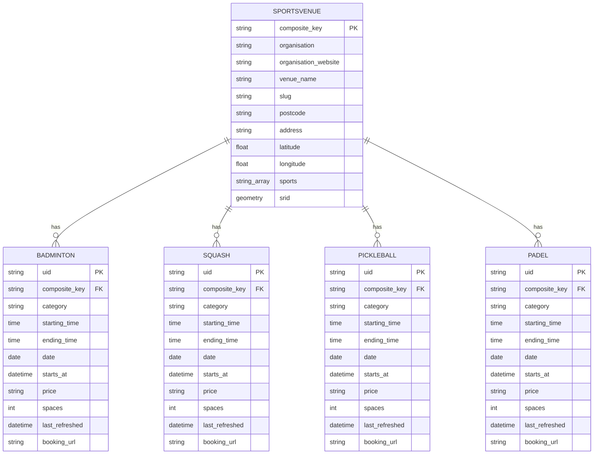

# Database

PostgreSQL (Aiven, managed), with PostGIS for geospatial queries.

## Schema

One table per sport rather than one polymorphic slots table. Each sport has a slightly
different write path (Better/GLL activity durations, Southwark's non-windowed dates,
TowerHamlets' truncate-reload) and the query shape is always "one sport, filtered by
venue and date", so separate tables keep indexes small and queries simple, at the cost
of four near-identical schemas.

`composite_key` is an MD5 hash of `organisation_website|slug` (first 8 characters).
It is the join key between `sportsvenue` and every slot table, and the identifier
the frontend and API use for a venue.

## Idempotency: uid as an idempotency key

Every slot's `uid` is `md5(composite_key-category-date-starting_time-ending_time)`,
a deterministic hash of the values that identify a specific bookable slot. The same
slot crawled twice, in the same run or a week apart, always produces the same `uid`.

Writes go through `INSERT ... ON CONFLICT (uid) DO UPDATE`. Re-running a crawl, retrying
a failed pipeline, or a provider returning the same data twice in one batch (a 40-minute
and a 60-minute API call both listing the same slot) are all safe: the same `uid` just
gets upserted again with whatever the latest response said. There is no separate
deduplication step outside of this key; the identifier itself carries the idempotency
guarantee.

## Marking stale slots

A provider dropping a slot (booked elsewhere, activity withdrawn) is only visible as an
absence in the next crawl, not an explicit "this slot is gone" signal. `insert_records_to_table`
handles this in two steps per pipeline run:

1. Upsert every slot in the incoming batch.
2. `UPDATE {table} SET spaces = 0 WHERE composite_key/date match this batch AND spaces != 0
   AND uid was not in the batch just upserted.`

Step 2 runs as a single indexed `UPDATE`, not a read into Python followed by a
reconstructed re-upsert. The previous version pulled every existing row for the
batch's composite_keys/dates into Python, diffed it in memory against the incoming
data, and rebuilt rows to re-upsert. That was a full round trip and object
reconstruction on every pipeline run for no reason: the database can express
"rows that exist but weren't just written" directly.

## Housekeeping: delete_past_slots

Nothing else in the write path removes rows. Without an explicit deletion step, every
slot table grows without bound: the crawl window only ever moves forward, so a date
that ages out of the window is written once and then never touched again.

`delete_past_slots(table)` runs `DELETE WHERE date < today()` at the end of every
pipeline run, for every sport. Past slots are never bookable and never shown (search
filters on `starts_at > now()`), so deleting them has no user-facing effect. This is
what actually bounds table size; the crawl logic alone does not.

## starts_at

`starts_at` is `date` and `starting_time` combined into a single timestamp, computed
once at write time in `insert_records_to_table`. Before this column existed, "is this
slot still in the future" was computed at query time as
`to_timestamp(concat(date, ' ', starting_time), 'YYYY-MM-DD HH24:MI:SS') > now()`,
a per-row string concatenation and parse that cannot use an index. `starts_at` is a
plain timestamp column, so the same comparison is a direct range check.

## Indexes

- `(composite_key, date)` on each slot table. Every search filters
  `composite_key IN (...) AND date == X`; this was previously unindexed (only the
  primary key `uid` existed), forcing a full table scan on every search and on every
  `delete_past_slots` run.
- Partial index on `(composite_key, date) WHERE spaces > 0`. `spaces > 0` is search's
  dominant filter (results only ever show bookable slots), so a partial index that
  excludes unavailable rows is smaller and cheaper than indexing the whole table.
- GiST index on `sportsvenue.srid`. `/venues/near` runs `ST_DWithin`/`ST_Distance`
  against this column; without a spatial index this sequential-scans as venue count
  grows.

## Why Postgres, not a queue

Crawling is a batch job: fetch, transform, upsert, on a schedule. There is no
consumer that needs to react to individual slot changes as they happen, and every
write is an idempotent upsert keyed by `uid`, not a fire-and-forget event. The read
side (search) needs to filter and join against current state (venue, date,
availability, distance), which is what a relational store is for. A queue would add
a broker, consumer group management, and dead-letter handling for a workload that is
already correctly modelled as "upsert the current state, on a schedule."

## Why a 5-connection pool per process

The Aiven plan caps `max_connections` at 20, with 3 reserved for the superuser role.
The API server and the crawler pipeline are separate processes and can run at the same
time; `pool_size=3, max_overflow=2` (5 connections per process) is a deliberate cap so
that a few concurrent processes can coexist without exhausting the connection limit.
This is a real ceiling, not an incidental default: scaling to more API replicas or
running the crawler pipeline concurrently with multiple API workers needs either a
larger Postgres plan or a connection pooler (for example PgBouncer) in front of it.
